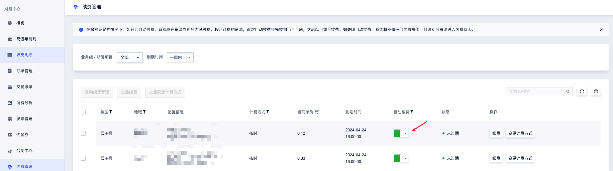
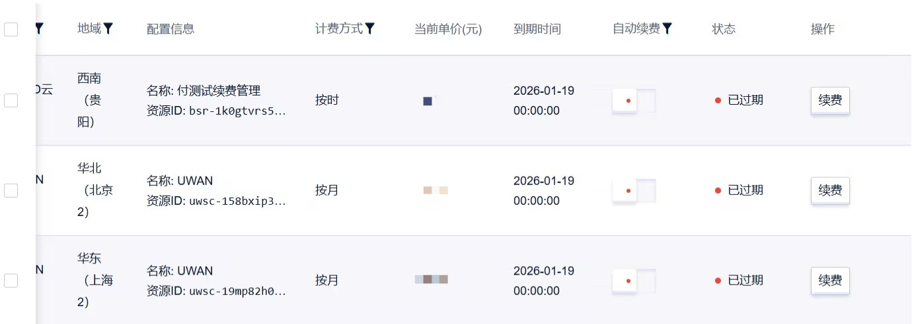
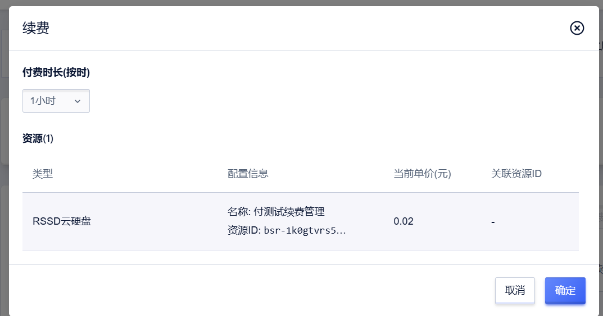

# 续费

优刻得支持两种续费模式，适用于预付费资源。

- **自动续费**：系统在资源到期时扣款续费，需提前开通并确保账户余额充足。
- **手动续费**：用户在资源到期前或到期后规定时间内手动操作续费。

## 自动续费规则和操作

### 续费规则

1. 年付、月付资源（除高防产品外）会在过期后的24小时内执行自动续费，如续费失败会进入回收。
2. 按时资（除高防产品外）会在过期后的1小时内执行自动续费，如续费失败会进入回收。

**续费周期规则**

月付的预付费资源（除高防产品外）在金额充足的情况下，首次自动续费会先自动续费到月底，之后再以自然月续费。

- **例**：某个按月付费的网络资源即将到期，在2025-5-15 17:58首次自动续费，系统会自动续费到2025-06-01 00:00:00，下一个续费周期是2025-06-01 00:00:00-2025-07-01 00:00:00。

按时的预付费资源（除高防产品外）在金额充足的情况下，首次自动续费会先对剩余额度，之后再以整数续费。（为避免系统因误造成业务影响，按时的未开启自动续费的资源在手动续费后会默认开启自动续费。）

- **例**：某个按月付费的网络资源即将到期，在17:30首次自动续费，系统会自动续费到18:00:00，下一个续费周期是18:00:00-19:00:00。

---

1. 若续费时账户可用余额不足，自动续费操作顺延至第二天，直到完成续费。
2. 若在资源过期时仍未完成续费，每日生成过期欠费订单，充值后系统自动延续上一周期续费，并撤销所有欠费订单，生成一张续费订单。

---
### 续费操作

**开通自动续费操作**

当您购买产品后，可登录控制台在 **财务中心 > 续费管理** 中查看该资源的“自动续费开关”。

开启“自动续费开关”，当您的账户余额充足时，系统会在即将到期时，自动为您续费（自动续费是按之前的配置和时长为您自动续费）。当账户余额不足时，若产品接入了回收系统，该资源会进入回收阶段；若产品未接入回收系统，系统会生成过期订单，您需要手动完成续费。

**关闭自动续费操作**

关闭“自动续费开关”，到期后资源进入欠费状态，系统会提示您资源到期和续费事宜，此时系统不会释放用户的资源，用户可以通过手动续费来进行续费，在续费时可重新选择续费周期。如果用户不进行充值并手动续费，则扣费失败，资源状态显示“已过期”。

## 手动续费规则和操作

### 触发场景
1. 自动续费开关已关闭；
2. 自动续费因账户余额不足失败；
3. 资源已过期且未完成自动续费。

### 续费规则
1. 续费时可重新选择续费周期（区别于自动续费的“按原配置续费”）；
2. 需先处理资源关联的欠费订单，方可完成续费。

### 手动续费操作
当您购买产品后，可登录控制台在 **财务中心 > 续费管理** 中查看该资源的续费操作，点击“续费”，自主选择续费周期。

